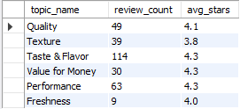
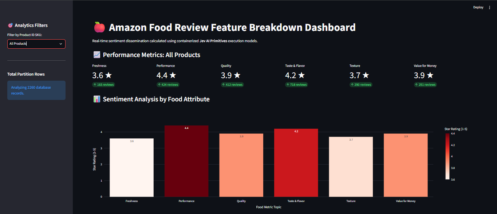

# Amazon Food Review Analyzer 🚀

An enterprise-ready, containerized **Natural Language Processing (NLP), Data Engineering, & Live Analytics Pipeline** that ingests messy, unstructured e-commerce product feedback from the **Kaggle Amazon Product Reviews** dataset and streams it into structured, granular feature breakdown metrics.

By leveraging **Jev AI (via the TypeSafe SDK)** over a secure OpenRouter proxy bridge, the application evaluates multi-dimensional customer sentiment to construct dynamic, **individual product SKU dashboards** and platform-wide aggregate star ratings stored in an isolated relational database and visualized via a real-time web portal.

---

## 📊 Comprehensive Project Summary & Ledger

### 🎯 Project Objectives (Why We Built This)

Standard e-commerce global review ratings (1-5 stars) provide an oversimplified look at customer satisfaction, often hiding specific details about individual product attributes (e.g., a snack with fantastic taste but terrible packaging).

To unlock granular product intelligence, this platform was built as a multi-container analytics service designed to:

- Isolate distinct feature-level customer feedback domain metrics (**Taste & Flavor, Freshness, Texture, Quality, Value for Money, and Performance**).
- Filter out textual noise by applying a strict **≥ 0.5 confidence threshold** on Jev AI topic mention probabilities before recording ratings.
- Demonstrate advanced professional competencies across **Data Engineering**, **Relational Database Design (MySQL)**, **Frontend Interface Design (Streamlit)**, and **System Containerization (Docker Compose)**.

### 🛠️ What We Have Done (Product-Aware Engineering Pipeline Flow)

1. **Multi-Container Microservice Isolation:** Architected an interconnected, multi-service network utilizing `docker-compose` to run an isolated database node (`mysql:8.0`), an active ingestion processing engine, and a web analytics server simultaneously.
2. **Database Schema Orchestration:** Designed an automated database initialization workflow (`init.sql`) inside the Docker engine structure to mount volumes and automatically provision analytics tables on startup with explicit **`product_id` fields** to separate SKU groups.
3. **Product-Aware Ingestion Engineering:** Programmed a bulletproof `main.py` ingestion loop that extracts unique `Id` and `ProductId` fields natively from the Kaggle dataset alongside text reviews. It features an extended connection timeout window to prevent pipeline drops over long runs.
4. **Optimized Batch Commit Streaming:** Engineered an chunked commit pattern (`if index % 10 == 0: conn.commit()`) that processes batches of **1,000 records** dynamically. This shaves significant execution time off the synchronous network loop by dramatically lowering disk I/O pressure on the MySQL node.
5. **Interactive Data Filtering & Visualization:** Developed an animated browser dashboard using **Streamlit** and **Plotly Express** featuring a dynamic sidebar dropdown filter selector. This allows users to seamlessly switch between broad global retail trends and isolated product SKU score panels.
6. **Git Cache Optimization:** Purged bloated hidden local caches from version history to decouple heavy raw datasets (`Reviews.csv`) from standard tracking, enforcing a production-clean repository well under GitHub's 100MB cap.

---

## 🏛️ System Architecture & File Manifest

- **`docker-compose.yml`** — Coordinates the entire containerized network layout, setting up port allocations, volumes, and environment variables.
- **`init-scripts/init.sql`** — Automated script executed by the MySQL engine on initial launch to create tables and database structures.
- **`main.py`** — The data orchestration pipeline; reads the raw CSV dataset, drives batch processing loops, and streams extracted metrics to MySQL.
- **`app.py`** — The dashboard web server script; handles live database reading and renders interactive Plotly charts.
- **`analyzer.py`** — Instantiates the authenticated `TypeSafeClient` over an OpenRouter endpoint to send evaluation tokens to the Jev model.
- **`questions.py`** — Stores the explicit food domain criteria instructions and satisfaction level matrices.
- **`aggregation.py`** — Performs mathematical calculation logic to average individual review scores into clean, aggregate star metrics.
- **`.github/workflows/ci-cd.yml`** — Cloud pipeline configuration that automatically verifies image compilation states on GitHub.

---

## 💻 System Configuration & Local Setup

### ⚙️ Prerequisites

Ensure the following tools are installed and active on your system:

- **Python 3.12**
- **Docker Desktop** (Must be open and running in the background)

### 🔑 1. Environment Variable Configuration

Create a file named exactly **`.env`** in the project root directory and add your private access configurations:

```text
TYPESAFE_API_KEY="your_openrouter_api_key_here"
TYPESAFE_BASE_URL="https://typesafe.ai"

# Secure Database Password Configuration
MYSQL_ROOT_PASSWORD="Combination2#"
MYSQL_PASSWORD="Combination2#"
```

_(Note: Wrapping passwords containing special symbols like `#` in double quotes ensures that the Docker environment parser interprets the string accurately without cutting text off as a code comments)._

### 📊 2. Dataset Alignment & Placement

1. Download the raw CSV review data payload files directly from Kaggle here: **[Kaggle Amazon Product Reviews Dataset](https://kaggle.com)**
2. Unzip the downloaded file package on your local computer.
3. Ensure the target dataset file is renamed to exactly **`Reviews.csv`** and save it directly in the project's root folder path.

---

## 🚀 Execution Instructions (Docker Run Controls)

Execute these two commands sequentially inside your terminal to clear out old container states, rebuild your layers, and launch the multi-service network:

```bash
# Step A: Drop old configurations and completely clear the database volume cache
docker-compose down -v

# Step B: Build and launch the microservice cluster
docker-compose up --build
```

---

## 🗄️ Database Verification (Using MySQL Workbench / DBeaver)

Because our system maps the database externally to bypass local host system port conflicts, you can connect desktop database tools directly to the running container using port **`3309`**.

### Connection Parameters:

- **Hostname:** `127.0.0.1` (or `localhost`)
- **Port:** `3309` _(⚠️ Do not use 3306!)_
- **Username:** `root`
- **Password:** `your password`
- **Database:** `review_analytics`

### Diagnostic SQL Analytics Queries:

```sql
USE review_analytics;

-- Track total review summary data grouped by product attributes
SELECT topic_name,
       COUNT(*) as review_count,
       ROUND(AVG(star_rating), 1) as avg_stars
FROM topic_scores
GROUP BY topic_name;
```

### Raw Database Result Output (Product-Aware Rows):



---

## 📈 Visualizing Real-Time Insights

Once the `pipeline_worker_core` container finishes streaming records into the database, minimize your terminal window and launch your browser interface link:
👉 **`http://localhost:8501`**

### Live Streamlit Dashboard UI Layout (Featuring Dynamic Product Filters):



---
